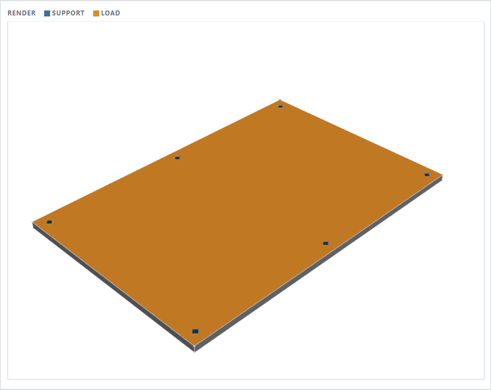
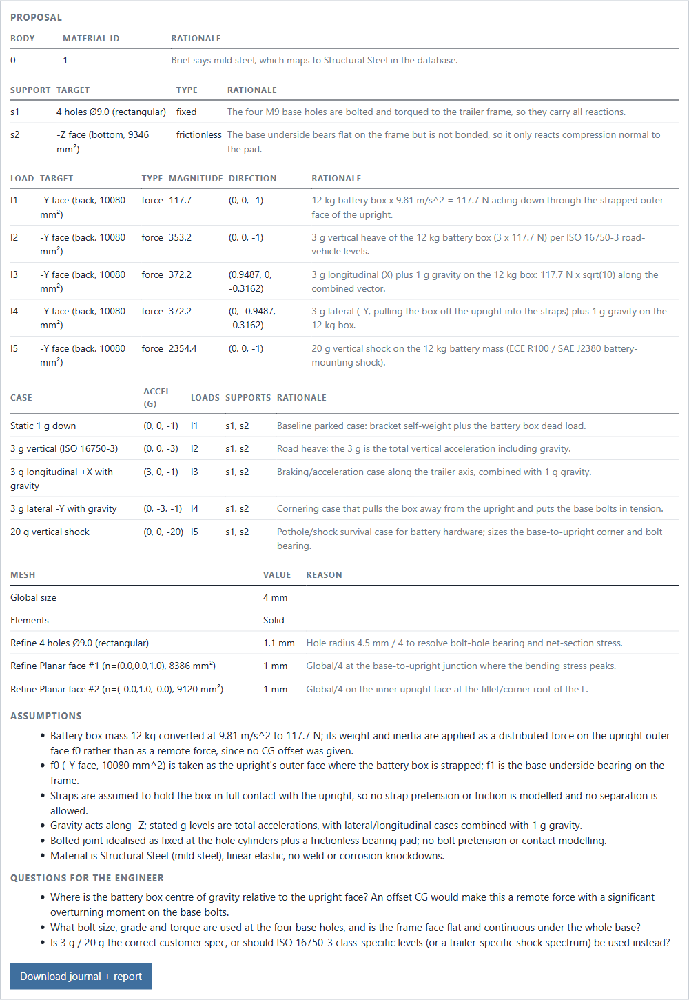
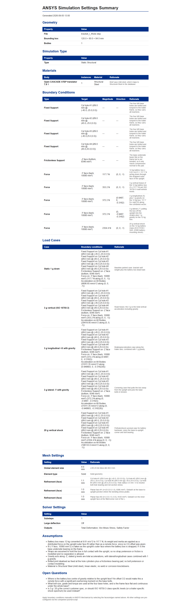

# ANSYS Workflow Tool

Two ways to go from a CAD file to a ready-to-run ANSYS Workbench setup:

1. **FEA Setup Agent** (web): describe the part's job in a sentence and let a model propose the full setup, checked by a deterministic validator. Below.
2. **Desktop wizard** (PyQt6): step through six guided screens with smart defaults computed from the geometry. See [The original desktop wizard](#the-original-desktop-wizard).

Both produce the same outputs: a Workbench journal (`.wbjn`) that applies every setting, and an HTML settings summary.

## FEA Setup Agent

Upload a STEP file, describe the part's job in a sentence or two, and get a complete ANSYS Static Structural setup: materials, supports, loads, load cases, and mesh, each with a rationale. A deterministic validator checks the proposal, a render shows which faces carry supports and loads, and the download is a Workbench journal plus an HTML report. An eval harness scores the agent against ten reference parts.

Live demo: not yet deployed

### Architecture

STEP → GeometryAnalyzer → Summary Builder (compact JSON) → Proposal Agent (Claude, structured output) → Validator (8 rules, one retry) → Adapter → Journal + Report. Renderer colors the chosen faces. FastAPI serves one page. See `docs/superpowers/specs/2026-09-03-fea-setup-agent-design.md`.

### Eval results

Latest run: 2026-09-05, playbook `caf827b46422`, 3 runs per part, claude-opus-5 (33 calls, 3 validator retries, no errors).

| part | load_cases | supports | loads | material | first_pass_valid | overall |
|---|---|---|---|---|---|---|
| bracket_flat_2hole | 1.00 ±0.00 | 1.00 ±0.00 | 1.00 ±0.00 | 1.00 ±0.00 | 0.33 ±0.50 | 0.87 ±0.10 |
| bracket_l_4hole | 1.00 ±0.00 | 1.00 ±0.00 | 1.00 ±0.00 | 1.00 ±0.00 | 1.00 ±0.00 | 1.00 ±0.00 |
| enclosure_lidless | 1.00 ±0.00 | 1.00 ±0.00 | 1.00 ±0.00 | 1.00 ±0.00 | 1.00 ±0.00 | 1.00 ±0.00 |
| frame_tube | 1.00 ±0.00 | 1.00 ±0.00 | 1.00 ±0.00 | 1.00 ±0.00 | 1.00 ±0.00 | 1.00 ±0.00 |
| lid_flat | 1.00 ±0.00 | 1.00 ±0.00 | 1.00 ±0.00 | 1.00 ±0.00 | 1.00 ±0.00 | 1.00 ±0.00 |
| mount_pedestal | 1.00 ±0.00 | 1.00 ±0.00 | 1.00 ±0.00 | 1.00 ±0.00 | 0.67 ±0.50 | 0.93 ±0.10 |
| pin_clevis | 1.00 ±0.00 | 1.00 ±0.00 | 1.00 ±0.00 | 1.00 ±0.00 | 1.00 ±0.00 | 1.00 ±0.00 |
| shaft_stepped | 1.00 ±0.00 | 1.00 ±0.00 | 1.00 ±0.00 | 1.00 ±0.00 | 1.00 ±0.00 | 1.00 ±0.00 |
| tray_open | 1.00 ±0.00 | 1.00 ±0.00 | 1.00 ±0.00 | 1.00 ±0.00 | 1.00 ±0.00 | 1.00 ±0.00 |
| weldment_tee | 1.00 ±0.00 | 1.00 ±0.00 | 1.00 ±0.00 | 1.00 ±0.00 | 1.00 ±0.00 | 1.00 ±0.00 |
| **all** | **1.00** | **1.00** | **1.00** | **1.00** | **0.90** | **0.98** |

Follow-up check after adding the mesh-refinement rule to the playbook (`abbce1e2fb30`, 1 run per part, 10 calls): 1.00 on every column, including `first_pass_valid`, so no proposal needed the validator retry. See `evals/results/2026-09-05_abbce1e2fb30.md`.

Scores are 0 to 1. `load_cases`, `supports`, `loads` are the fraction of reference items matched (by id or an accepted alternative). `material` is family match. `first_pass_valid` is whether the validator passed without a retry. Three runs per part; ± is half the spread.

### Screenshots

Flat aluminum lid: six screw holes fixed (blue), 2 kPa wind pressure on the top face (orange).

Proposal for the L-bracket eval part: materials, supports, loads, load cases (including a 20 g shock), mesh, assumptions, and questions for the engineer.

The HTML report that ships in the download zip next to the Workbench journal and the STEP file.

## Run the agent locally

    conda env create -f environment.yml && conda activate fea-agent
    export ANTHROPIC_API_KEY=...
    uvicorn src.web.app:app --reload

On Linux without a display, start Xvfb first and export DISPLAY, or just use the Docker image: `Xvfb :99 -screen 0 1280x1024x24 &  export DISPLAY=:99`

## Run the agent with Docker

    docker build -t fea-agent .
    docker run -p 8000:8000 -e ANTHROPIC_API_KEY=... fea-agent

## Deploy

Pick Fly.io or Render. For Fly:

    fly launch --no-deploy
    fly secrets set ANTHROPIC_API_KEY=...
    fly deploy

Accept the generated `fly.toml` with internal port 8000. Record the public URL in this README. Memory: request at least 2 GB; cadquery plus vtk needs it.

## Tests and evals

    python -m pytest -q
    python -m evals.run_evals --repeats 3

## The original desktop wizard

The agent grew out of a Windows desktop app that simplifies ANSYS Workbench/Mechanical setup for engineers who would rather confirm good defaults than fill in every field. It still lives in `src/wizard` and shares the analyzer, material database, and journal generator with the agent.

**What it does**

- Loads STEP, IGES, or Parasolid (`.x_t`) geometry and analyzes it with cadquery: bounding box, volume, body count, thin walls, holes, symmetry planes, and sharp edges that concentrate stress.
- Supports Static Structural, Transient Structural, and Thermal-Structural simulations.
- Pre-fills every screen from a smart-defaults engine that maps the geometry features and simulation type to recommended materials, mesh sizing, and solver settings.
- Six wizard pages: Upload, Simulation type, Material, Boundary conditions, Mesh, Solver and output.
- The boundary-conditions page embeds a 3D viewer (pyvista in Qt); click a face in the model to set it as the target of a support or load, or pick from the auto-detected face labels.
- Materials come from a bundled SQLite library with modulus, Poisson's ratio, density, thermal properties, and strength values, searchable from the wizard.
- Output is a Workbench journal that applies every confirmed setting when run from Workbench, plus an HTML settings summary you can print to PDF.

**Run it**

    pip install -r requirements.txt
    python -m src.main

**Package it** as a single executable with PyInstaller (the spec file is generated on first build):

    pyinstaller --onefile --windowed -n ansys-setup-wizard src/main.py

Design notes: `docs/superpowers/specs/2026-05-09-ansys-workflow-tool-design.md` (wizard) and `docs/superpowers/specs/2026-05-30-bc-face-picking-design.md` (face picking).
